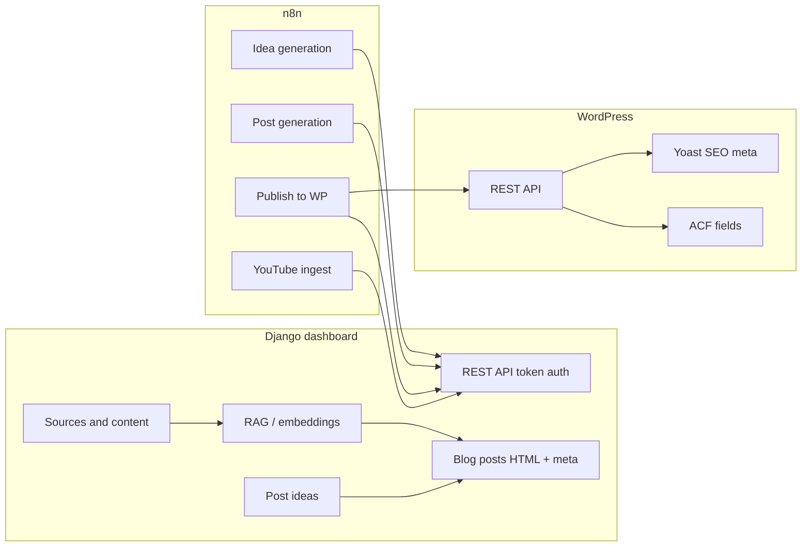

# SinoTales blog architecture

This document describes how the **China Blog Dashboard** (Django), **n8n** automation, and the **WordPress** site ([sinotales.com](https://sinotales.com)) work together to ingest sources, generate ideas and posts, and publish structured content with SEO and ACF fields.

---

## High-level picture

**End-to-end flow (typical automation):**

1. **Sources** are collected (dashboard UI, APIs, or n8n) → transcripts and article text are stored as **Content** with optional tags and embeddings.
2. **Post ideas** are created (manually, via dashboard AI, or n8n calling the API).
3. A **blog post** is generated from an idea (LLM + optional RAG + metadata + FAQ).
4. **Publishing** pulls the oldest unpublished post from the dashboard export API, uploads images to WordPress, replaces `[IMG-n]` placeholders, creates tags, and creates a post with **ACF** + **Yoast** meta.

---

## Part 1 — The dashboard (this repository)

The dashboard is a Django application documented in [`README.md`](README.md). It is the **system of record** for sources, raw content, post ideas, generated posts, images, and activity logs.

### Core concepts

| Concept | Role |
|--------|------|
| **Source** | YouTube channel, blog, ebook, or RSS feed. Holds connection settings (e.g. channel ID, sitemap URL, China filter for videos). |
| **Content** | One video, blog post, or ebook chunk. Stores title, link, text body, tags, processing flags. |
| **ContentChunk** + **embeddings** | Long text split into chunks with `pgvector` embeddings for semantic RAG when generating blog posts. |
| **PostIdea** | Title, description, optional primary keyword, embedding for duplicate detection. |
| **BlogPost** | Full HTML article, slug, `meta_title`, `meta_description`, `featured_image_description`, JSON **FAQ**, tags, `published`, `online_url`, linked images. |

### Sources and extraction

- **YouTube:** From the content detail screen you can **Get Transcript**; the app fetches captions (with optional proxy support). Videos can also be created via the API (`POST /api/video-content/`) with `auto_process` to transcript, tag, and embed.
- **Blogs:** **Fetch Content** runs extraction from the post URL (readability-style extraction in the content pipeline). Blog posts can be created via `POST /api/blog-post/`.
- **Ebooks / CSV:** Import commands and CSV formats are described in the README (French ebooks can be translated to English on import).

### Tagging, embeddings, RAG

- **Auto-tagging** (`auto_tag_content` management command or UI): Ollama or OpenAI assigns tags from your taxonomy.
- **Embeddings** (`generate_embeddings`): requires content with text and at least one tag; chunks are embedded for retrieval.
- **Blog post generation** can call **RAG** to inject relevant chunks from your library into the prompt (`use_rag`, `num_chunks`).

### Post ideas

- **UI:** List, add, edit, delete; **Generate Ideas** with provider/model, optional tags and content inspiration.
- **Duplicate control:** New ideas get embeddings and are compared to existing ones (~80–85% similarity threshold); similar ideas are skipped.
- **API:** `POST /post-ideas/api/generate/` (and variants) for automation; `GET /api/post-ideas` with search; `POST /api/post-ideas/create/` with title, description, `primary_keyword`, optional `similarity_threshold`.

### Blog posts

- **From UI:** Open a post idea → **Generate Blog Post** (prompt from `prompt-post-generation.md`, dynamic year, optional Nomad eSIM shortcode instructions).
- **Metadata:** **Generate Metadata** uses `prompt-metadata-generator` to fill SEO fields, slug, tags, featured image alt text, FAQ title, and four FAQ Q&As.
- **Images:** Parsed from HTML into `BlogPostImage`; you can **upload** images and manage them per post. Export can replace `` with `[IMG-id]` for WordPress placement.
- **API:** `POST /api/generate-blog-post` with `post_idea_id`, provider/model, RAG options, and metadata provider/model — creates the `BlogPost` and runs metadata generation in one call.

### Content splitting for WordPress (intro / summary / main / conclusion)

The dashboard does **not** store separate intro/main/conclusion in the database for every post. The **WordPress export** endpoint parses the single HTML `content` field with `_parse_blog_content_sections()` in [`sources/views/utils.py`](sources/views/utils.py):

- **Intro:** From after the H1 through the block before the summary box (Quick Summary, Key Takeaways, **TL;DR**, etc.).
- **Summary:** `summary_title` + `summary_content` (bullet list in the styled box).
- **Main content:** Body sections; **images** may become `[IMG-{id}]` placeholders for n8n to swap with WordPress media URLs.
- **Conclusion:** Detected via a `Conclusion` heading or fallback heuristics.

This matches how the live article is structured (see screenshot: TL;DR box, then H2 sections, then FAQ).

### Authentication and API

- Dashboard pages require login.
- Programmatic access uses **`API_TOKEN`** (header `Authorization: Token …` / `Bearer …`, or `?token=`). See README for env vars.

Key routes (see [`sources/urls.py`](sources/urls.py)) include:

- `GET/POST` … `/api/youtube-channels/`, `/api/blog-sources/`, `/api/video-content`, `/api/blog-post`
- `GET` `/api/post-ideas`, `POST` `/api/post-ideas/create`, `GET` `/api/post-ideas/context`, `POST` `/post-ideas/api/generate`
- `POST` `/api/generate-blog-post`
- `GET` `/api/blog-posts/export-wordpress` — optional `oldest_unpublished=true` for the next post to publish
- `PATCH` `/api/blog-posts/<id>/update-status` — set `published` and `online_url` after WordPress publish

---

## Part 2 — n8n workflows

Workflow JSON files live under [`n8n/`](n8n/). They call the **production dashboard host** (replace with your own URL and rotate tokens in n8n credentials; do not commit secrets).

### 1. Post idea generation — `n8n_post_idea_generation_workflow.json`

- **Name in n8n:** e.g. `gimme ideas`
- **Trigger:** Schedule (example: daily at 07:00).
- **Flow:** `Edit Fields` sets `num_ideas` (e.g. 3) and `similarity_threshold` → **AI Agent** (Gemini) with tools:
  - **search post ideas** — `GET` dashboard `/api/post-ideas?search=…`
  - **create an idea** — `POST` `/api/post-ideas/create` with title, description, `primary_keyword`, threshold
  - **get context inspiration** — `GET` `/api/post-ideas/context/` for random tags/content when ideas are rejected as too similar
- **Outcome:** The agent loops until it creates the requested number of unique ideas; similarity is enforced server-side.
- **Notifications:** Email on success; error trigger emails on failure.

### 2. Blog post generation — `n8n_post_generation_workflow.json`

- **Name in n8n:** e.g. `generate blog post`
- **Trigger:** Schedule (example: daily at 06:00).
- **Flow:** **AI Agent** with tools:
  - **get last published posts** / **search published posts** — `GET` `/api/blog-posts` to avoid duplicates and judge diversity
  - **search post ideas** — `GET` `/api/post-ideas` with `exclude_with_posts=true` so only ideas not yet turned into posts are considered
- The agent outputs **JSON** with `selected_idea_id`, scores, and reasoning → **parse output** → **HTTP Request** `POST` `/api/generate-blog-post` with Gemini, RAG (`use_rag: true`, `num_chunks: 5`), and metadata generation.
- **Outcome:** A full `BlogPost` exists in the dashboard (draft, with metadata and FAQ when generation succeeds).
- **Notifications:** Success and error emails.

### 3. Publish to WordPress — `publish posts.json`

- **Name in n8n:** e.g. `publish posts`
- **Trigger:** Schedule (example: daily at 08:00).
- **Flow (conceptual):**
  1. **GET** `/api/blog-posts/export-wordpress?oldest_unpublished=true` — one post with `acf` (intro, main_content with placeholders, conclusion, summary, FAQs), `meta` (Yoast-ready title/description), tags, image URLs, etc.
  2. Resolve **tags** against WordPress (`/wp-json/wp/v2/tags`), create missing tags.
  3. Upload **featured** and **inline** images to WordPress media; replace `[IMG-n]` in main content with uploaded media markup/URLs.
  4. **AI or rules** may choose **category** (workflow-specific).
  5. **POST** `/wp-json/wp/v2/posts` with:
     - Core fields: `title`, `slug`, `content` (full HTML for the block editor context), `excerpt` (often derived from intro), `status`, `tags`, `categories`, `featured_media`
     - **`acf`:** `intro`, `main_content`, `conclusion`, `summary_title`, `summary_content`, `faqs_title`, `question_1`…`answer_4`
     - **`meta`:** `_yoast_wpseo_title`, `_yoast_wpseo_metadesc`
  6. Call dashboard **`update-status`** so the post is marked published and the live URL stored.

Exact node names and order are in the JSON; the important contract is **export API → media → REST post with ACF + Yoast meta**.

### 4. YouTube transcript pipeline — `extract-youtube-transcript.json`

- **Name in n8n:** e.g. `YouTube`
- **Trigger:** Schedule (example: hourly).
- **Flow:**
  1. Load dashboard base URL + API token (code node).
  2. **GET** `/api/youtube-channels/` — list channels.
  3. For each channel, fetch **YouTube RSS** (`feeds/videos.xml?channel_id=…`), parse XML, filter to **recent** uploads (e.g. “yesterday”) and optionally exclude Shorts.
  4. **POST** `/api/video-content` with `source_id`, `external_id` (video id), title, link, `auto_process: true` — dashboard runs transcript + tagging + embeddings as configured.
  5. Email notification with processing summary.

This feeds the **content library** used for RAG and human review in the dashboard.

---

## Part 3 — WordPress (sinotales.com)

### Theme and plugins

- **WordPress REST API** (`/wp-json/wp/v2/...`) creates posts, tags, and media.
- **Advanced Custom Fields (ACF)** — field group exported in [`wordpress/Export ACF Sinotales.json`](wordpress/Export%20ACF%20Sinotales.json), attached to **post** type, **`show_in_rest`: true** so ACF keys can be sent in REST `acf` payloads.
- **Yoast SEO** — title and meta description are set via post meta keys (e.g. `_yoast_wpseo_title`, `_yoast_wpseo_metadesc`) from the dashboard’s `meta_title` / `meta_description`, which n8n passes in the `meta` object.

### ACF field group (“Posts Fields”) — mapping to the dashboard export

| ACF field name | Purpose |
|----------------|--------|
| `intro` | Opening paragraphs (HTML). |
| `main_content` | Article body; may contain replaced images after publish workflow. |
| `conclusion` | Closing section. |
| `summary_title` | Short heading for the TL;DR / summary box. |
| `summary_content` | Bullet list HTML for the summary. |
| `faqs_title` | FAQ section title. |
| `question_1` … `question_4` | FAQ questions (text). |
| `answer_1` … `answer_4` | FAQ answers (WYSIWYG). |

The theme renders these in order: hero/title from the post, then intro, summary block, main content with images, callouts, FAQ accordion, conclusion — matching the **reference screenshot** ([`wordpress/screencapture-sinotales-destinations-xinjiang-china-travel-tips-xinjiang-road-trip-2026-2026-03-29-09_01_44.png`](wordpress/screencapture-sinotales-destinations-xinjiang-china-travel-tips-xinjiang-road-trip-2026-2026-03-29-09_01_44.png)): TL;DR box, H2 sections, images, FAQ accordion, tags.

### Yoast SEO

- **Meta title** and **meta description** generated in the dashboard (metadata prompt) align with Yoast’s expectations; n8n writes them to Yoast’s meta keys when creating the post so search snippets are controlled without manual copy-paste.

### Optional shortcodes

- Generated content may include WordPress shortcodes (e.g. Nomad eSIM CTA via WPCode). The theme executes shortcodes in the rendered content.

---

## How everything connects (orchestration summary)

| Step | Where it runs | What happens |
|------|----------------|--------------|
| Ingest YouTube | n8n + dashboard API | New videos → Content with transcript |
| Ingest blogs / manual | Dashboard UI + API | Content with extracted text |
| Tag & embed | Dashboard commands / auto_process | Tags + chunks + vectors |
| Create ideas | n8n idea workflow or UI | PostIdea rows with deduplication |
| Generate article | n8n post workflow or UI | BlogPost HTML + SEO + FAQ + images |
| Publish | n8n publish workflow | Export → WP media → REST post + ACF + Yoast → update-status |

**Single source of truth:** The Django database. WordPress is the **publication target**; after publish, the dashboard stores the **live URL** and **published** flag for auditing and to avoid republishing the same draft.

---

## Files and references

| Resource | Path |
|----------|------|
| Dashboard README | [`README.md`](README.md) |
| Post generation prompt | [`prompt-post-generation.md`](prompt-post-generation.md) |
| Metadata + FAQ prompt | [`prompt-metadata-generator`](prompt-metadata-generator) |
| Section parsing + ACF shaping | [`sources/views/utils.py`](sources/views/utils.py), [`sources/views/api.py`](sources/views/api.py) |
| ACF export | [`wordpress/Export ACF Sinotales.json`](wordpress/Export%20ACF%20Sinotales.json) |
| Example live layout | [`wordpress/screencapture-sinotales-destinations-xinjiang-china-travel-tips-xinjiang-road-trip-2026-2026-03-29-09_01_44.png`](wordpress/screencapture-sinotales-destinations-xinjiang-china-travel-tips-xinjiang-road-trip-2026-2026-03-29-09_01_44.png) |
| n8n workflows | [`n8n/n8n_post_idea_generation_workflow.json`](n8n/n8n_post_idea_generation_workflow.json), [`n8n/n8n_post_generation_workflow.json`](n8n/n8n_post_generation_workflow.json), [`n8n/publish posts.json`](n8n/publish%20posts.json), [`n8n/extract-youtube-transcript.json`](n8n/extract-youtube-transcript.json) |

---

*Document generated for the china-blog-dashboard project. Update n8n schedules, URLs, and credentials in your own deployment notes; keep API tokens out of version control.*
