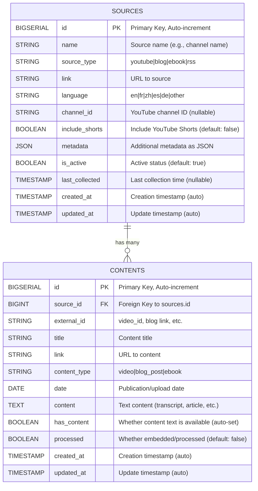

# Database Structure Diagram

## Current Database Schema

## Field Descriptions

### sources Table

| Field | Type | Constraints | Notes |
|-------|------|-------------|-------|
| id | BIGSERIAL | PRIMARY KEY | Auto-increment |
| name | VARCHAR(255) | NOT NULL | Source name |
| source_type | VARCHAR(20) | NOT NULL, CHECK | Values: youtube, blog, ebook, rss |
| link | VARCHAR(500) | NOT NULL | Valid URL format |
| language | VARCHAR(20) | NOT NULL, CHECK | Values: en, fr, zh, es, de, other |
| channel_id | VARCHAR(100) | NULL | YouTube-specific, optional |
| include_shorts | BOOLEAN | NOT NULL, DEFAULT false | YouTube-specific |
| metadata | JSONB | DEFAULT '{}' | Flexible JSON storage |
| is_active | BOOLEAN | NOT NULL, DEFAULT true | Status flag |
| last_collected | TIMESTAMP | NULL | Track last collection time |
| created_at | TIMESTAMP | NOT NULL, DEFAULT NOW() | Auto-set on creation |
| updated_at | TIMESTAMP | NOT NULL, DEFAULT NOW() | Auto-update on change |

### contents Table

| Field | Type | Constraints | Notes |
|-------|------|-------------|-------|
| id | BIGSERIAL | PRIMARY KEY | Auto-increment |
| source_id | BIGINT | FOREIGN KEY, NOT NULL | References sources.id |
| external_id | VARCHAR(255) | NOT NULL | video_id, blog slug, etc. |
| title | VARCHAR(500) | NOT NULL | Content title |
| link | VARCHAR(500) | NOT NULL | URL to content |
| content_type | VARCHAR(20) | NOT NULL, CHECK | Values: video, blog_post, ebook |
| date | DATE | NOT NULL | Publication/upload date |
| content | TEXT | NULL | Text content (transcript, article) |
| has_content | BOOLEAN | NOT NULL, DEFAULT false | Whether content text is available (auto-set) |
| processed | BOOLEAN | NOT NULL, DEFAULT false | Embedding/processing status |
| created_at | TIMESTAMP | NOT NULL, DEFAULT NOW() | Auto-set on creation |
| updated_at | TIMESTAMP | NOT NULL, DEFAULT NOW() | Auto-update on change |

### Indexes

**sources table:**
1. **idx_sources_source_type** - Index on `source_type` column
2. **idx_sources_language** - Index on `language` column
3. **idx_sources_is_active** - Index on `is_active` column
4. **idx_sources_channel_id** - Partial index on `channel_id` (WHERE channel_id IS NOT NULL)
5. **idx_sources_link** - Index on `link` column
6. **idx_sources_metadata** - GIN index on `metadata` JSONB column for efficient JSON queries

**contents table:**
1. **idx_contents_source** - Index on `source_id` (foreign key)
2. **idx_contents_external_id** - Index on `external_id` column
3. **idx_contents_content_type** - Index on `content_type` column
4. **idx_contents_date** - Index on `date` column
5. **idx_contents_has_content** - Index on `has_content` column
6. **idx_contents_processed** - Index on `processed` column

**Unique Constraints:**
- `contents(source_id, external_id)` - Ensures no duplicate content per source

## Entity Relationship

- **sources** (1) → (many) **contents**: One source can have many content items
- Cascade delete: If a source is deleted, all its contents are deleted
